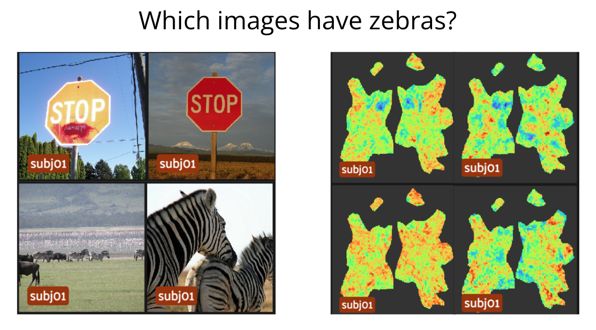

# boldGPT 🧠



Humans struggle to "see" the structure in functional MRI (BOLD) brain maps. Our goal is to train a GPT that understands brain maps better than humans. This kind of "foundation" model should be useful for things like phenotype prediction and brain activity decoding. Plus it will hopefully generate neat fake brain maps.

## Installation

Clone the repo and install the package in a new virtual environment

```bash
git clone https://github.com/clane9/boldGPT.git
cd boldGPT

python3 -m venv --prompt boldgpt .venv
source .venv/bin/activate
pip install -U pip
pip install -r requirements.txt
pip install -e .
```

## Roadmap

- [x] Prepare the [natural scenes dataset](https://naturalscenesdataset.org/) for GPT consumption
  - [x] NSD "beta" activity vectors to flat maps ([NSD-Flat](nsd_flat), [🤗](https://huggingface.co/datasets/clane9/NSD-Flat))
  - [x] Flat maps to tokenized patch sequences ([`BoldTokenizer`](boldgpt/tokenizer.py)) supporting raster, radial, and random order.
- [ ] Implement baselines
  - [ ] PCA masked patch prediction
- [x] Implement model
  - [x] [`BoldGPT`](boldgpt/model.py) supporting causal/cross attention, masking, and shuffled prediction. Borrows elements from [timm](https://github.com/huggingface/pytorch-image-models/blob/main/timm/models/vision_transformer.py), [nanoGPT](https://github.com/karpathy/nanoGPT), and [BEiT](https://github.com/microsoft/unilm/blob/master/beit/modeling_pretrain.py).
- [ ] Implement train and inference scripts
- [ ] Train models
- [ ] Evaluate masked patch prediction
- [ ] Generate pretty brain maps


## Contribute

If you'd like to contribute, please feel free fork the repo and join (or start!) a conversation in our [issues](https://github.com/clane9/boldGPT/issues).
